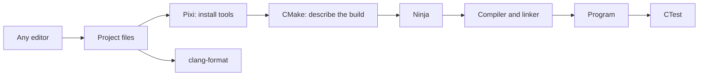
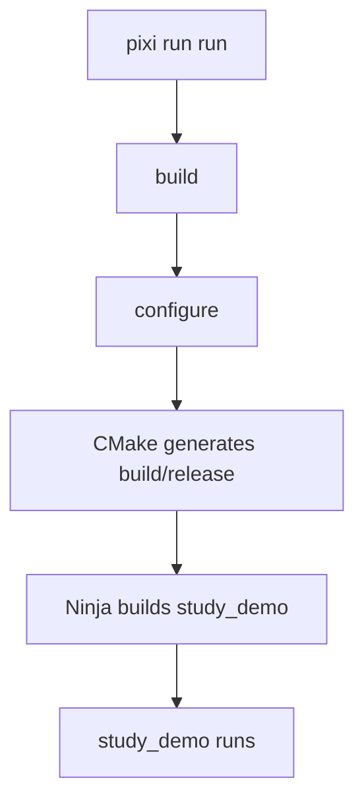
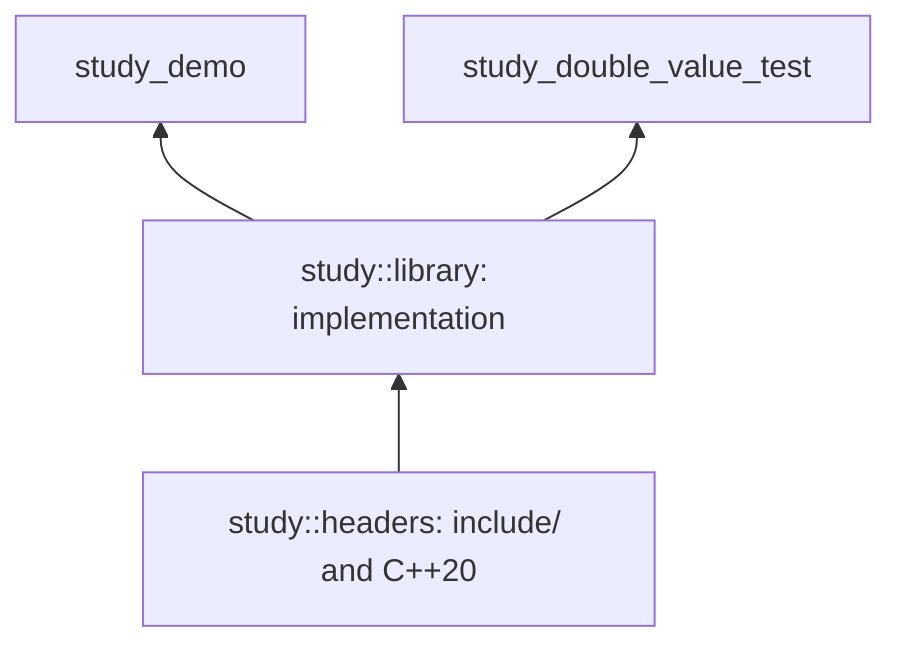

# Study guide: a C++ environment you can run from a terminal

**Languages:** English · [Українська](STUDY.uk.md)

> Goal: write a few ordinary text files yourself, get a compiler and tools through Pixi, and build the project with one command. Any editor works: Notepad, Vim, Emacs, Kate, Sublime Text, or whatever you prefer. VS Code is not required for this workflow.

This guide is for someone who can already write a small C++ program but does not yet know how to share it with a working build environment. Each stage adds one understandable capability. You can build the first program after section 4; the remaining sections gradually introduce the ideas used in Rangeforge.

**There are two different projects here:** `study-cpp` is an example you create in a separate directory; Rangeforge is the existing repository used to explain the later decisions. Do not replace Rangeforge files with the examples from the beginner sections.

## Contents

1. [What we want to reproduce](#part-1)
2. [Using the existing Rangeforge environment](#part-2)
3. [Creating an empty study project](#part-3)
4. [Three files and your first build](#part-4)
5. [Why you need a lockfile](#part-5)
6. [Adding a library, headers, and a test](#part-6)
7. [Making commands convenient with tasks](#part-7)
8. [Setting up formatting](#part-8)
9. [Attaching options to targets](#part-9)
10. [Simplifying the root CMake file](#part-10)
11. [Working with lint and Python](#part-11)
12. [Bootstrap: an environment after cloning](#part-12)
13. [The same command in GitHub Actions](#part-13)
14. [Daily work and troubleshooting](#part-14)
15. [What “ready to share” means](#part-15)
16. [Practical exercises](#part-16)

<a id="part-1"></a>

## 1. What we want to reproduce

Imagine a lab assignment: a student writes `main.cpp` and sends it to the instructor. To run it, the instructor still needs to know:

- which compiler and C++ standard to use;
- which libraries and tools to install;
- which command to run;
- how to check the result;
- which dependency versions the author used.

An environment becomes plug-and-play when those answers are stored in the repository and a short instruction explains how to start.

```text
Repository                         After installation
──────────────────────────         ───────────────────────────
source code                    →   source code stays in place
pixi.toml: requirements         →   .pixi/envs/default/: tools
pixi.lock: selected packages    →   installed package versions
CMakeLists.txt: build targets   →   build/: objects and programs
tasks: commands                 →   pixi run build / test / check
```

### Who does what

| Tool | Responsibility | What you write yourself |
| --- | --- | --- |
| Editor | Lets you change text | Source code and configuration |
| Pixi | Installs dependencies and runs commands in the environment | `pixi.toml` |
| CMake | Describes targets and generates a build system | `CMakeLists.txt` |
| Ninja | Executes the required build steps | Usually nothing: CMake generates its files |
| C++ compiler | Turns source files into object files | C++ code |
| Linker | Combines objects and libraries into a program | Target relationships in CMake |
| CTest | Runs registered checks | `add_test(...)` |
| clang-format | Checks and applies C++ formatting | `.clang-format` |
| Git | Stores source code, configuration, and history | Meaningful commits |
| GitHub Actions | Runs commands on a separate machine | A workflow in `.github/workflows/` |

**The editor is not part of the build chain.** After saving a file, you can perform every required action from a terminal.



If your Markdown viewer does not render Mermaid, remember the short chain: **Pixi → CMake → Ninja → compiler → program**.

### What reproducibility means in this guide

We lock tool packages and record commands for supported platforms. This does not promise identical executable bytes across operating systems. The host machine still has requirements: a suitable architecture, operating system, system libraries, and, for some toolchains, an SDK. The first installation needs access to package sources.

<a id="part-2"></a>

## 2. Using the existing Rangeforge environment

If you simply want to work in this repository, you can leave the study project for later.

### Windows x86-64, PowerShell

Open a terminal at the repository root:

```powershell
.\scripts\bootstrap.ps1
.\.pixi\bin\pixi.exe run check
```

### Linux x86-64 and macOS on Apple Silicon

```sh
sh scripts/bootstrap.sh
./.pixi/bin/pixi run check
```

The scripts download a pinned Pixi release, verify its SHA-256, and run `install --locked`. You do not need to install Python, Node.js, CMake, or a compiler separately for this workflow. You do need the tools that run bootstrap itself: PowerShell on Windows, or a shell and download/hash utilities on Unix.

Supported platforms here are `win-64`, `linux-64`, and `osx-arm64`. An Intel Mac or Linux ARM host requires extending the manifest and bootstrap separately.

### What `check` does in Rangeforge

```text
check
├── format-check                         clang-format
├── test
│   └── build
│       └── configure                    CMake → Ninja
└── rf001                                declaration spacing rule
```

The command includes formatting checks, a build, three CTest checks, and RF001. The tree shows dependencies; the order of independent branches should not be treated as a contract.

Test executables currently appear in `build/ninja-release/test/`, and the implementation library appears in `build/ninja-release/src/`. CTest is the convenient way to run tests because it knows where their executables are.

<a id="part-3"></a>

## 3. Creating an empty study project

From now on, work **in a new `study-cpp` directory**, separate from Rangeforge.

### Create a directory

Windows:

```powershell
New-Item -ItemType Directory study-cpp
Set-Location study-cpp
New-Item -ItemType Directory src
```

Linux/macOS:

```sh
mkdir -p study-cpp/src
cd study-cpp
```

Save files as plain UTF-8 text. On Windows, enable file extension visibility: `pixi.toml.txt` and `CMakeLists.txt.txt` will not be recognized as the intended configuration files.

### Get one tool: Pixi

For this exercise, an installed Pixi available as `pixi` in your terminal is sufficient. Choose a method from the [official installation instructions](https://pixi.prefix.dev/latest/installation/).

You can also use a local executable:

1. Open [Pixi release v0.81.0](https://github.com/prefix-dev/pixi/releases/tag/v0.81.0), the version used by this repository's bootstrap.
2. Download the file for your operating system and architecture.
3. Put it in `study-cpp/.pixi/bin/`, named `pixi.exe` on Windows or `pixi` on Unix.
4. On Unix, make it executable: `chmod +x .pixi/bin/pixi`.
5. Check the version: `./.pixi/bin/pixi --version` or `.\.pixi\bin\pixi.exe --version`.

| System | File in that release |
| --- | --- |
| Windows x86-64 | `pixi-x86_64-pc-windows-msvc.exe` |
| Linux x86-64 | `pixi-x86_64-unknown-linux-musl` |
| macOS ARM64 | `pixi-aarch64-apple-darwin` |

The `msvc` part of the Windows filename describes how Pixi itself was built. Your study project's C++ compiler is selected separately in the manifest.

To use the short `pixi` command in subsequent examples, add the local directory **only to the current terminal session**.

PowerShell:

```powershell
$studyPixiBin = (Resolve-Path .pixi/bin).Path
$env:PATH = "$studyPixiBin;$env:PATH"
pixi --version
```

Unix shell:

```sh
export PATH="$(pwd)/.pixi/bin:$PATH"
pixi --version
```

When you open a new terminal, repeat this setup or use the full path to local Pixi. This exercise does not require changing `PATH` globally.

<a id="part-4"></a>

## 4. Three files and your first build

### File 1: `src/main.cpp`

```cpp
#include <iostream>

int main() {
    std::cout << "Hello from a reproducible C++ environment!\n";
    return 0;
}
```

### File 2: `CMakeLists.txt`

```cmake
cmake_minimum_required(VERSION 3.28)
project(study LANGUAGES CXX)

add_executable(study_demo src/main.cpp)
target_compile_features(study_demo PRIVATE cxx_std_20)
```

A line-by-line explanation:

| Line | Meaning |
| --- | --- |
| `cmake_minimum_required(...)` | Sets the minimum version and corresponding CMake policies |
| `project(... LANGUAGES CXX)` | Declares the project and enables C++ compiler support |
| `add_executable(...)` | Creates a program target from the specified source |
| `target_compile_features(...)` | Requires C++20 for this target |

A **target** is a named build object: a program, library, or collection of requirements. We describe `study_demo`; CMake constructs the compiler commands.

### File 3: `pixi.toml`

```toml
[workspace]
name = "study-cpp"
channels = ["conda-forge"]
platforms = ["win-64", "linux-64", "osx-arm64"]

[dependencies]
cmake = ">=3.28"
ninja = "*"

[target.win-64.dependencies]
gcc_win-64 = "*"
gxx_win-64 = "*"

[target.linux-64.dependencies]
compilers = "*"

[target.osx-arm64.dependencies]
compilers = "*"

[tasks]
configure = "cmake -S . -B build/release -G Ninja -DCMAKE_BUILD_TYPE=Release"
build = { cmd = "cmake --build build/release", depends-on = ["configure"] }
run = { cmd = "build/release/study_demo", depends-on = ["build"] }
```

The manifest contains three groups of information:

```text
workspace       Where to find packages and which platforms to support
dependencies    Which tools are required
tasks           Which commands to run
```

`*` permits any compatible version when dependencies are resolved. The selected packages will be recorded in the lockfile. Windows uses MinGW-w64 here; Linux and macOS use the corresponding compiler packages from conda-forge.

### Now run

```sh
pixi install
pixi run run
```

The expected result is the line from `main.cpp` printed in the terminal. Installation, configuration, and build messages will appear before it.



### What the CMake arguments mean

```sh
cmake -S . -B build/release -G Ninja -DCMAKE_BUILD_TYPE=Release
```

| Argument | Meaning |
| --- | --- |
| `-S .` | Source files are in the current directory |
| `-B build/release` | Generated files go in a separate directory |
| `-G Ninja` | Generate build files for Ninja |
| `-DCMAKE_BUILD_TYPE=Release` | Select Release for the ordinary Ninja generator used here |

`cmake --build build/release` invokes the selected build system. You do not have to write a separate `g++` command for each file.

The resulting directory contains:

```text
study-cpp/
├── src/main.cpp              written by you
├── CMakeLists.txt            written by you
├── pixi.toml                 written by you
├── pixi.lock                 created by Pixi
├── .pixi/                    installed tools
└── build/release/            generated files and build results
```

### Add `.gitignore`

```gitignore
/.pixi/
/build/
```

Source code, the manifest, and the lockfile belong in Git. Downloaded tools and build results can be recreated and do not need to be stored in history.

<a id="part-5"></a>

## 5. Why you need a lockfile

`pixi.toml` and `pixi.lock` answer different questions:

| File | Question | Example |
| --- | --- | --- |
| `pixi.toml` | What is acceptable for the project? | CMake 3.28 or newer |
| `pixi.lock` | What exactly was selected? | A particular CMake package and its dependencies for each platform |

An ordinary `pixi install` may resolve dependencies and update the lockfile. `pixi install --locked` requires the manifest and lockfile to agree and fails if the lockfile is out of date. This is useful when receiving an already prepared project. [Reference: `pixi install`](https://pixi.prefix.dev/latest/reference/cli/pixi/install/)

### The project author's workflow

After changing requirements:

```sh
pixi lock
pixi install --locked
git diff -- pixi.toml pixi.lock
```

Inspect the package changes, then commit the manifest and lockfile together.

### Another student's workflow

After receiving the project:

```sh
pixi install --locked
pixi run --locked run
```

`--locked` on `run` also prevents silently resolving new dependencies. An ordinary `pixi run` may install the environment and update the lockfile when needed. [Reference: `pixi run`](https://pixi.prefix.dev/latest/reference/cli/pixi/run/)

**Do not confuse `--locked` with `--frozen`.** `--frozen` uses the lockfile without checking that it matches the manifest; it does not replace the consistency check in this study project's CI.

### Why sending only `.pixi/` is not enough

An installed environment contains platform-specific files and can depend on its installation path. The recipient should recreate it with Pixi. Share the configuration, lockfile, source code, and bootstrap instructions.

The lockfile records packages separately for supported platforms; it does not turn a Windows program into a Linux program. [Lockfile documentation](https://pixi.prefix.dev/latest/workspace/lock_file/)

<a id="part-6"></a>

## 6. Adding a library, headers, and a test

Now turn the single program into a small project with a library. **Replace** the study project's `CMakeLists.txt` and `src/main.cpp`, and create three new files.

```text
study-cpp/
├── include/study/double_value.hpp
├── src/double_value.cpp
├── src/main.cpp
├── test/double_value.cpp
├── CMakeLists.txt
├── pixi.toml
└── pixi.lock
```

Create the missing directories using your operating system or editor.

### Public header: `include/study/double_value.hpp`

```cpp
#pragma once

namespace study {

int double_value(int value);

} // namespace study
```

### Implementation: `src/double_value.cpp`

```cpp
#include <study/double_value.hpp>

namespace study {

int double_value(int value) {
    return value * 2;
}

} // namespace study
```

This example assumes that the multiplication result fits in `int`. A production function needs a defined input range or overflow handling.

### Program: the new `src/main.cpp`

```cpp
#include <study/double_value.hpp>

#include <iostream>

int main() {
    std::cout << study::double_value(21) << '\n';
    return 0;
}
```

### Check: `test/double_value.cpp`

```cpp
#include <study/double_value.hpp>

int main() {
    if (study::double_value(21) != 42)
        return 1;
    if (study::double_value(0) != 0)
        return 1;
    if (study::double_value(-3) != -6)
        return 1;
    return 0;
}
```

CTest understands exit codes: `0` means success; a nonzero code means failure. This check deliberately uses explicit `return` statements so that it works in Release too, where ordinary `assert` checks can be disabled by `NDEBUG`.

### The new `CMakeLists.txt`

```cmake
cmake_minimum_required(VERSION 3.28)
project(study LANGUAGES CXX)

include(CTest)

add_library(study_headers INTERFACE)
add_library(study::headers ALIAS study_headers)
target_compile_features(study_headers INTERFACE cxx_std_20)
target_sources(study_headers INTERFACE
  FILE_SET HEADERS
  BASE_DIRS include
  FILES include/study/double_value.hpp
)

add_library(study_library STATIC src/double_value.cpp)
add_library(study::library ALIAS study_library)
target_link_libraries(study_library PUBLIC study::headers)

add_executable(study_demo src/main.cpp)
target_link_libraries(study_demo PRIVATE study::library)

if(BUILD_TESTING)
  add_executable(study_double_value_test test/double_value.cpp)
  target_link_libraries(study_double_value_test PRIVATE study::library)
  add_test(NAME study_double_value COMMAND study_double_value_test)
endif()
```

### Understanding the relationships



An `INTERFACE` target does not compile a separate `.cpp` here; it passes requirements to consumers. A `STATIC` target creates an archive of implementation object files. `ALIAS` gives an existing target a convenient name and does not create a second library.

| Relationship | Applies requirements to the target itself? | Passes them to consumers? |
| --- | --- | --- |
| `PRIVATE` | Yes | No for ordinary compile requirements |
| `PUBLIC` | Yes | Yes |
| `INTERFACE` | No | Yes |

The library uses its public header and passes the include directory to the program, so its relationship with `study::headers` is `PUBLIC`. The program uses the library for its own build, so that relationship is `PRIVATE`. For static libraries, CMake also preserves dependencies needed for final linking; the table does not mean `PRIVATE` always disappears entirely from the link graph. [Reference: `target_link_libraries`](https://cmake.org/cmake/help/v3.28/command/target_link_libraries.html)

### What `FILE_SET HEADERS` provides

We explicitly list the public header and its include root. For an `INTERFACE` header set, CMake adds `BASE_DIRS` to consumers' include requirements in the build tree. This example does not need another `target_include_directories` call for the same directory. Later, the set can be used for installation and export. [File set documentation](https://cmake.org/cmake/help/v3.28/command/target_sources.html#file-sets)

The name `study::headers` alone does not make this an installed CMake package. The program currently uses targets within the same build.

### What `include(CTest)` provides

The module creates the standard `BUILD_TESTING` option and enables testing support when that option is on. It is on by default in an ordinary configuration. [CTest documentation](https://cmake.org/cmake/help/v3.28/module/CTest.html)

Add this line to the existing `[tasks]` section in the study project's `pixi.toml`:

```toml
test = { cmd = "ctest --test-dir build/release --output-on-failure", depends-on = ["build"] }
```

Now you can run:

```sh
pixi run run
pixi run test
```

The program should print `42`, and CTest should report a successful `study_double_value` check.

For a separate build without tests:

```sh
pixi run cmake -S . -B build/library -G Ninja -DCMAKE_BUILD_TYPE=Release -DBUILD_TESTING=OFF
pixi run cmake --build build/library
```

`pixi run cmake ...` runs a tool from the environment; you do not need a separate task for every one-off command.

<a id="part-7"></a>

## 7. Making commands convenient with tasks

A command should express an intention: build, run, or check. Store long arguments in the manifest so you do not have to memorize them.

After section 6, the study project's complete `[tasks]` section looks like this:

```toml
[tasks]
configure = "cmake -S . -B build/release -G Ninja -DCMAKE_BUILD_TYPE=Release"
build = { cmd = "cmake --build build/release", depends-on = ["configure"] }
run = { cmd = "build/release/study_demo", depends-on = ["build"] }
test = { cmd = "ctest --test-dir build/release --output-on-failure", depends-on = ["build"] }
```

Do not create a second `[tasks]` section: extend or replace the existing one.

### `depends-on` declares dependencies

```text
pixi run test
     │
     ├─ configure: prepare the build system
     ├─ build: build missing or changed files
     └─ test: run the checks
```

Running `test` automatically includes the required earlier steps. Running `build` again does not mean recompiling everything: Ninja determines which results are out of date.

Pixi tasks form a dependency graph. A task without its own command can group several tasks, such as `check`. [Task documentation](https://pixi.prefix.dev/latest/workspace/advanced_tasks/)

Useful commands for exploring the manifest:

```sh
pixi task list
pixi task --help
pixi run --help
```

### One command for you and the reviewer

Once `format-check` is introduced below, add:

```toml
check = { depends-on = ["format-check", "test"] }
```

`check` does not need its own shell command. It means that all listed checks must complete successfully.

Keep longer automation programs in separate files and call them from tasks. The manifest remains a readable map of commands.

<a id="part-8"></a>

## 8. Setting up formatting

Now add one automated quality rule to the study project: consistent source formatting.

### Step 1. Install the tool through the manifest

Add this to the existing `[dependencies]` section:

```toml
clang-format = "21.*"
```

Then update dependencies:

```sh
pixi lock
pixi install --locked
```

### Step 2. Create `.clang-format`

```yaml
BasedOnStyle: LLVM
IndentWidth: 4
ColumnLimit: 100
```

This is the study project's formatting policy. In the existing Rangeforge project, use its existing `.clang-format`.

### Step 3. Create `tools/check-format.cmake`

```cmake
set(study_cpp_files)
foreach(directory IN ITEMS src include test)
  file(GLOB_RECURSE directory_files
    "${CMAKE_CURRENT_LIST_DIR}/../${directory}/*.cpp"
    "${CMAKE_CURRENT_LIST_DIR}/../${directory}/*.hpp"
  )
  list(APPEND study_cpp_files ${directory_files})
endforeach()

if(NOT study_cpp_files)
  message(FATAL_ERROR "No C++ files found.")
endif()

execute_process(
  COMMAND clang-format --dry-run --Werror ${study_cpp_files}
  RESULT_VARIABLE format_result
)
if(NOT format_result EQUAL 0)
  message(FATAL_ERROR "Formatting check failed.")
endif()
```

This example searches only for `.cpp` and `.hpp` files in three directories. If you use other extensions or add `examples/`, extend the list explicitly.

`CMAKE_CURRENT_LIST_DIR` is the directory containing the script itself. It lets the script construct paths relative to its own location.

### Step 4. Add tasks

Add these to the existing `[tasks]` section:

```toml
format-check = "cmake -P tools/check-format.cmake"
check = { depends-on = ["format-check", "test"] }
```

Then run:

```sh
pixi run format-check
pixi run check
```

To apply formatting to one file:

```sh
pixi run clang-format -i src/main.cpp
```

`--dry-run --Werror` checks formatting; `-i` modifies the file. Review the diff after formatting.

### Why `GLOB_RECURSE` is appropriate here

The checking script discovers files afresh on every invocation. That is convenient for this one-time traversal. Build targets' sources and public headers are listed explicitly in the study project: those lists are part of the program's definition.

CMake has different operating modes:

```text
cmake -S . -B build/release     configure a project
cmake --build build/release    invoke the build
cmake -P tools/check-format.cmake
                               execute a separate script
```

Rangeforge encountered a real failure: `CONFIGURE_DEPENDS` was used in `file(GLOB_RECURSE ...)` inside a script invoked through `cmake -P`. That mode does not support the option, and every CI platform stopped at the first step. The lesson: a familiar CMake command is not necessarily valid in every operating mode.

<a id="part-9"></a>

## 9. Attaching options to targets

From this section onward, we examine **Rangeforge's existing structure**. The study project already works. Adopt the following techniques when needed, substituting your own target names.

When a project has multiple targets, it helps to separate a library's public requirements from internal development settings.

```text
Public library contract            Project development settings
───────────────────────────        ──────────────────────────────
include directories                sanitizers
C++20                              clang-tidy invocation
public dependencies                other internal checks
```

### A separate target for project options

[cmake/ProjectOptions.cmake](cmake/ProjectOptions.cmake) contains:

```cmake
add_library(rangeforge_project_options INTERFACE)
```

When sanitizers are enabled, their requirements are attached to that target:

```cmake
target_compile_options(rangeforge_project_options INTERFACE
  -fsanitize=address,undefined -fno-omit-frame-pointer
)
target_link_options(rangeforge_project_options INTERFACE
  -fsanitize=address,undefined
)
```

A project target then consumes them:

```cmake
target_link_libraries(rangeforge_solutions PRIVATE rangeforge_project_options)
```

Sanitizers need two things here: instrumentation during compilation and support during final linking. In Rangeforge, both the implementation library and the test executable targets consume the options target.

Internal settings are not attached to the public header-only `rangeforge` target. An ordinary header consumer receives the include directory and the C++20 requirement.

### Why avoid global commands

Global `add_compile_options`, `add_link_options`, and `CMAKE_CXX_CLANG_TIDY` settings propagate through directory scope and defaults. As third-party libraries and different build modes appear, it becomes harder to see which targets are affected.

Target configuration makes that visible next to the target's definition:

```cmake
rangeforge_apply_project_options(rangeforge_solutions)
```

### clang-tidy is assigned to a particular target

```cmake
set_property(TARGET rangeforge_solutions PROPERTY CXX_CLANG_TIDY
  "${RANGEFORGE_CLANG_TIDY_EXE};--config-file=${PROJECT_SOURCE_DIR}/.clang-tidy"
)
```

This target property runs analysis during the build. Rangeforge places that assignment in `rangeforge_apply_project_options` so the library and tests receive the same setup without copied lines.

### Enabling analysis

Rangeforge provides a `release-lint` preset. Run CMake from the Pixi environment:

```sh
pixi run cmake --preset release-lint
pixi run cmake --build --preset release-lint
```

The preset stores configuration parameters; Pixi supplies tools. A preset does not install a compiler or `clang-tidy`.

### Enabling sanitizers

For Rangeforge's supported Linux workflow:

```sh
pixi run test-sanitize
```

It uses a separate build directory, `build/ninja-sanitize`. Do not interpret this command as a ready-made Windows sanitizer workflow: runtime availability and toolchain support vary by platform.

Use a separate build directory when changing compiler or instrumentation mode. A `build/` directory already contains CMake's cache and toolchain detection results.

<a id="part-10"></a>

## 10. Simplifying the root CMake file

Splitting files is useful once the project has several parts. For a one-file program, section 4's CMake file is enough.

### The Rangeforge map

```text
CMakeLists.txt                    connects the project parts
cmake/ProjectOptions.cmake        defines internal options
include/CMakeLists.txt            describes public headers
src/CMakeLists.txt                describes implementation library
test/CMakeLists.txt               creates and registers tests
```

The root stays short:

```cmake
cmake_minimum_required(VERSION 3.28)
project(rangeforge LANGUAGES CXX)

include(CTest)
include(cmake/ProjectOptions.cmake)

add_subdirectory(include)
add_subdirectory(src)

if(BUILD_TESTING)
  add_subdirectory(test)
endif()
```

The order matters: options and the public target are created before targets that use them.

### Public headers

[include/CMakeLists.txt](include/CMakeLists.txt):

```cmake
add_library(rangeforge INTERFACE)
add_library(rangeforge::rangeforge ALIAS rangeforge)

target_compile_features(rangeforge INTERFACE cxx_std_20)
target_sources(rangeforge INTERFACE
  FILE_SET HEADERS
  BASE_DIRS "${CMAKE_CURRENT_SOURCE_DIR}"
  FILES
    rangeforge/solutions.hpp
    rangeforge/subset_average_oracle.hpp
    rangeforge/test.hpp
    rangeforge/types.hpp
)
```

Here `CMAKE_CURRENT_SOURCE_DIR` already refers to `include/`, because the file is processed through `add_subdirectory(include)`.

### Implementations

[src/CMakeLists.txt](src/CMakeLists.txt):

```cmake
add_library(rangeforge_solutions STATIC
  maximum_deletions_balanced.cpp
  maximum_deletions_packed.cpp
)
add_library(rangeforge::solutions ALIAS rangeforge_solutions)

target_link_libraries(rangeforge_solutions PUBLIC rangeforge::rangeforge)
rangeforge_apply_project_options(rangeforge_solutions)
```

Source paths in `src/` are also relative to that subdirectory.

### A function for repeated test setup

[test/CMakeLists.txt](test/CMakeLists.txt):

```cmake
function(rangeforge_add_test name source library)
  set(target "rangeforge_${name}_test")
  add_executable(${target} ${source})
  target_link_libraries(${target} PRIVATE ${library})
  rangeforge_apply_project_options(${target})
  add_test(NAME "rangeforge_${name}" COMMAND ${target})
endfunction()

rangeforge_add_test(differential differential.cpp rangeforge::solutions)
rangeforge_add_test(oracle oracle.cpp rangeforge::rangeforge)
rangeforge_add_test(mutation mutation_test.cpp rangeforge::rangeforge)
```

The function is useful because four actions repeat with small differences. It should not become a separate configuration language: its parameters remain understandable—a name, a source file, and a library.

### Keep the CMake minimum consistent in three places

| Location | What it stores |
| --- | --- |
| `CMakeLists.txt` | `cmake_minimum_required(VERSION 3.28)` |
| `CMakePresets.json` | `cmakeMinimumRequired` with minor version `28` |
| `pixi.toml` | `cmake = ">=3.28"` |

Update the lockfile after changing requirements. If the selected CMake package already satisfies them, the lockfile may remain unchanged; that is normal.

<a id="part-11"></a>

## 11. Working with lint and Python

Distinguish tools by the job they do:

| Check | What it sees | What it checks |
| --- | --- | --- |
| clang-format | C++ text structure for formatting | Indentation, wrapping, and whitespace |
| clang-tidy | Code and Clang's semantic information | Selected bug and code-quality checks |
| Rangeforge's RF001 | AST through libclang | A blank line after a declaration group |
| CTest | Results of executing programs | The algorithm behavior being tested |

### Start with an existing tool

For ordinary formatting, `clang-format` is sufficient. For static analysis, first look at existing `clang-tidy` checks. A custom rule makes sense when the project has a specific requirement that the selected existing checks do not cover.

### An RF001 example

A violation of the project rule:

```cpp
int result = 0;
int step = 2;
result += step;
```

Separated groups:

```cpp
int result = 0;
int step = 2;

result += step;
```

These are function-body fragments, not standalone `.cpp` files. A comment between the groups does not replace a blank line.

### Why the rule uses Clang

A C++ declaration can span multiple lines and include templates, lambdas, and macros. In Rangeforge, Clang parses the code, while [tools/lint/rf001.py](tools/lint/rf001.py) compares adjacent `DeclStmt` nodes and other statements within a `CompoundStmt`. The script implements the project rule; LLVM parses the language.

```text
C++ source
    ↓
libclang: preprocessor and AST
    ↓
Python bindings: access to nodes
    ↓
RF001: inspect the gap between statements
    ↓
file:line + message + exit code
```

### Dependencies for this particular rule

In the current Rangeforge manifest:

```toml
[dependencies]
python = ">=3.13"
clang = "21.*"
libclang13 = "21.*"

[pypi-dependencies]
clang = "==21.1.7"
```

This is an excerpt from the existing manifest. If you adopt it, merge the entries into your existing sections.

| Package | Purpose |
| --- | --- |
| `python` from conda-forge | Runs the script |
| `clang` from conda-forge | Driver that reports toolchain header paths |
| `libclang13` from conda-forge | Native Clang C API library |
| `clang` from PyPI | Python bindings for accessing the C API |

Similar names refer to different layers. `libclang13` is a conda package name; the version specified here is LLVM 21. The PyPI bindings are not a compiler and do not provide the native library. [Bindings package description](https://pypi.org/project/clang/)

Parser, bindings, and builtin headers need compatible versions. The manifest and lockfile record that choice. Rangeforge's custom C-function table and DLL/so loader were removed; LLVM's bindings load the library after receiving its location in the environment.

### How the rule joins the workflow

```toml
rf001 = "python tools/lint/rf001.py ."
lint = { depends-on = ["rf001"] }
check = { depends-on = ["format-check", "test", "rf001"] }
```

RF001 does not depend on a CMake build. Run it with:

```sh
pixi run rf001
```

| RF001 exit code | Meaning |
| --- | --- |
| `0` | The check completed without violations |
| `1` | Rule violations were found |
| `2` | Setup or source parsing failed |

If Clang could not parse a source file, that is not a successful style check. Fix the toolchain configuration or source code first.

### A separate environment for research

Rangeforge keeps scientific packages in an additional feature:

```toml
[feature.research.dependencies]
numpy = "*"
scipy = "*"
pandas = "*"
matplotlib = "*"
ipython = "*"

[environments]
default = ["default"]
research = ["default", "research"]
```

`research` combines base dependencies with additional packages. In the current project, Python already belongs to the base environment for linting.

```sh
pixi run -e research python
```

Research dependencies are therefore not required for ordinary building and linting in the base environment.

<a id="part-12"></a>

## 12. Bootstrap: an environment after cloning

We now have dependencies and commands. One first-run question remains: how does the recipient get Pixi itself?

**Bootstrap** is a small startup script that installs the tool needed to install the other tools.

### A sufficient algorithm

```text
1. Find the repository root relative to the script itself
2. Select the Pixi executable for the current OS and architecture
3. Download a specific release to a temporary file
4. Compare its SHA-256 with the expected value
5. Move the verified file into .pixi/bin/
6. Run local Pixi: install --locked
7. Print the command for further work
```

### Reuse the small existing scripts

You can copy these two files from this repository into the study project:

- [scripts/bootstrap.ps1](scripts/bootstrap.ps1) for Windows;
- [scripts/bootstrap.sh](scripts/bootstrap.sh) for Linux x86-64 and macOS ARM64.

Save them in `study-cpp/scripts/` with the same names. Change only the final informational message: replace Rangeforge with `study-cpp` and show the `run check` command introduced in section 8. Downloading and installation concern Pixi and do not depend on the C++ target name.

Before copying, read the scripts from top to bottom. Each contains a fixed version, URL, expected hash, installation path, and `install --locked` invocation. They are ordinary text files you can understand and modify yourself.

When updating Pixi, update the version, release asset name, expected SHA-256, and CI version together. A new URL with the old hash will fail verification.

### What SHA-256 verifies

The comparison confirms that downloaded bytes match the expected artifact. Obtain the expected value from a trusted source and review it when updating the script. A hash calculated only after an arbitrary download and immediately accepted as the reference is not an independent check.

To inspect a downloaded file's hash manually on Windows:

```powershell
Get-FileHash -Algorithm SHA256 .pixi/bin/pixi.exe
```

On Linux:

```sh
sha256sum .pixi/bin/pixi
```

On macOS:

```sh
shasum -a 256 .pixi/bin/pixi
```

### Why `install --locked`

The recipient installs dependencies already selected by the author. If the author changed the manifest and forgot the lockfile, bootstrap should report an error.

### What stays local

Rangeforge's scripts set `PIXI_HOME` and `PIXI_CACHE_DIR` inside `.pixi/` during installation. However, variables set in the separate Unix process `sh scripts/bootstrap.sh` do not become variables in the parent terminal.

If you want to keep the same cache path for later commands, explicitly set it in your session.

PowerShell:

```powershell
$studyRoot = (Get-Location).Path
$env:PIXI_HOME = Join-Path $studyRoot '.pixi/home'
$env:PIXI_CACHE_DIR = Join-Path $studyRoot '.pixi/cache'
```

Unix:

```sh
export PIXI_HOME="$(pwd)/.pixi/home"
export PIXI_CACHE_DIR="$(pwd)/.pixi/cache"
```

The project environment itself lives in `.pixi/envs/`. Local installation does not mean the workflow is entirely offline: an empty cache requires downloads. Git for cloning and the basic tools needed to execute bootstrap remain prerequisites.

<a id="part-13"></a>

## 13. The same command in GitHub Actions

Create `.github/workflows/ci.yml` in the study project:

```yaml
name: CI

on: [push, pull_request]

permissions:
  contents: read

jobs:
  check:
    runs-on: ${{ matrix.os }}
    timeout-minutes: 20
    strategy:
      fail-fast: false
      matrix:
        os: [ubuntu-latest, windows-latest, macos-15]
    steps:
      - uses: actions/checkout@v7.0.1
      - uses: prefix-dev/setup-pixi@v0.10.0
        with:
          pixi-version: v0.81.0
          locked: true
          cache: true
      - run: pixi run --locked check
```

The action and Pixi versions come from the current [Rangeforge workflow](.github/workflows/ci.yml). These are fixed versions for this guide; update them in a separate change. The example assumes that the manifest, lockfile, and `check` task from earlier sections are already committed.

### Read the workflow as a sequence

```text
checkout         get source code and configuration from Git
setup-pixi       get Pixi and install the locked environment
run check        invoke the workflow available to the student
```

The matrix starts independent jobs for different runner images. Each operating system builds its own program. Having three platforms in the lockfile is useful, but successful dependency resolution alone does not prove that compilation succeeds on all three.

### What belongs in CI configuration

The workflow contains trigger conditions, runners, and project command invocations. CMake and Pixi already describe complete build commands; duplicating them in YAML creates another place for configurations to drift apart.

### When to add path filters

For a beginner, running on every push and pull request is simpler. If you later add path filters, include all paths affecting the build: `cmake/**`, CMake files in subdirectories, the manifest, lockfile, sources, and checking tools.

Rangeforge added `cmake/**` to its filters after extracting options. Otherwise, changes to sanitizer or clang-tidy settings might not start CI.

### Reading a failed job

Look for the first message giving a specific cause, not just the final `Process completed with exit code 1` line.

```text
Incorrect formatting
    → format-check stopped

CMake error
    → build directory configuration failed

C++ error
    → compilation stopped

Nonzero exit code from a test program
    → CTest reports a failed test

Lint parsing error
    → a complete source check could not be performed
```

If different platforms fail on the same script line before compilation, start with the shared script. In Rangeforge's earlier failure, every job reported `CONFIGURE_DEPENDS`, so the formatting CMake script was fixed first.

<a id="part-14"></a>

## 14. Daily work and troubleshooting

### The normal study project cycle

```text
open a terminal at the project root
    ↓
edit a file with any editor
    ↓
pixi run run or pixi run test
    ↓
correct the result
    ↓
pixi run check
    ↓
review git diff and commit
```

### Command reference

These commands use the short `pixi` name. In Rangeforge without a `PATH` adjustment, replace it with `.\.pixi\bin\pixi.exe` or `./.pixi/bin/pixi`.

| Goal | Command |
| --- | --- |
| Install a received environment | `pixi install --locked` |
| List project commands | `pixi task list` |
| Build | `pixi run build` |
| Run the study program | `pixi run run` |
| Run tests | `pixi run test` |
| Check formatting | `pixi run format-check` |
| Run all main checks | `pixi run check` |
| Resolve the lockfile after a manifest change | `pixi lock` |
| Review changes before committing | `git diff` |
| Run a tool from the environment | `pixi run cmake --version` |

### Confirming that a tool comes from the environment

Inspect tools through Pixi:

```sh
pixi run cmake --version
pixi run ninja --version
```

A plain `cmake` command outside Pixi may find a different installation. CMake's configure output also shows the compiler identifier and path. This is more useful than guessing from installed applications.

### Common problems

| Symptom | Common cause | First step |
| --- | --- | --- |
| `pixi` not found | Local executable is missing or absent from `PATH` | Use the full path; inspect bootstrap |
| CMake cannot find the project | Wrong directory or filename | Check the root and exact `CMakeLists.txt` name |
| Lockfile is out of date | Manifest was changed separately | Author runs `pixi lock` and commits both files |
| CMake cannot find a compiler | Command ran outside the installed environment | Use `pixi run`; read the configure log |
| Public header is not found | Include requirements were not passed along | Inspect `FILE_SET HEADERS` and target relationships |
| `undefined reference` / unresolved external | Implementation is missing from the link | Inspect the library target and `target_link_libraries` |
| `No tests were found` | Tests are disabled or a different build directory was selected | Check `BUILD_TESTING` and `ctest --test-dir` |
| Program differs from current source | An old executable was launched | Run a task that depends on `build` |
| New compiler is not being used | Previous configuration remains in the build cache | Choose a new build directory |
| Format script fails before compilation | Formatting script or tool error | Read the first format-check message |
| RF001 reports a parse error | Clang could not parse the source with these headers/flags | Inspect the toolchain, versions, and diagnostics |
| PowerShell blocks `.ps1` | Machine execution policy applies | Ask the administrator about permitted execution; manual installation steps are also available |

### A cache error and a check error are separate messages

Rangeforge logs included failed cache saves when several jobs tried to create the same entry. Separately, jobs failed on a specific formatting script error. Diagnose the step that returned a nonzero exit code; a nearby cache warning does not establish a causal relationship.

### Keeping a useful history

After completing a stage, commit its related files together:

```text
build: add a minimal Pixi and CMake environment
feat: add a library and its test
style: add formatting checks
refactor: scope project options to targets
ci: run the same checks on supported platforms
docs: explain how to reproduce the environment
```

These are example titles, not a required Git format. Each commit should read as one completed change. When dependencies change, the manifest and lockfile must remain consistent within that commit.

<a id="part-15"></a>

## 15. What “ready to share” means

### A minimum set for a lab assignment

```text
source code
CMakeLists.txt
pixi.toml
pixi.lock
.gitignore
README with installation and run commands
```

Additions as needed:

```text
bootstrap scripts       installation of Pixi itself
tests                   expected behavior checks
.clang-format           consistent formatting
CI                      checks on a separate machine
STUDY.md                explanation of the project structure
```

`.pixi/` and `build/` do not belong in this set. The recipient recreates them from the text files.

### Two stages: convenient development and an installable library

Rangeforge currently provides `rangeforge::rangeforge` and `rangeforge::solutions` within its CMake build tree. It does not yet install a package with a config file for `find_package`.

The next stage for use from other projects is:

1. Define the installed API: headers, implementation library, and target names.
2. Add installation of targets and `FILE_SET HEADERS`.
3. Export targets with the required namespace and stable export names.
4. Create `rangeforgeConfig.cmake`, and a version file and dependency description if needed.
5. Check a separate consumer project against the installed prefix.

Only then will this scenario work:

```cmake
# Future consumer; the current Rangeforge has no installed package yet.
find_package(rangeforge CONFIG REQUIRED)
target_link_libraries(app PRIVATE rangeforge::rangeforge)
```

`FILE_SET HEADERS` helps describe installable headers but does not automatically create the whole package. Namespaced targets within a source build do not replace a package config.

### What not to complicate in advance

A one-file study project does not need a custom package manager, build command generator, or editor extension to start the build. Begin with working standard tools. Add a CMake function, Pixi feature, or separate script when a clear repetition or new task appears.

### A criterion for an independent environment

Someone with a suitable operating system and bootstrap tools should be able to obtain the source, follow the instructions to install tools, build the program, and run checks without recreating your personal editor configuration.

<a id="part-16"></a>

## 16. Practical exercises

### Exercise A. Change the program

Change `21` to `15` in the study program and run `pixi run run`.

**Expected result:** `30`. Find which files were rebuilt in the output. Explain why the library does not have to be recompiled when only `main.cpp` changes.

### Exercise B. A check must be able to fail

Temporarily change `double_value` to `return value * 3;` and run `pixi run test`.

**Expected result:** a failed test and a nonzero exit code. Restore the correct implementation and run the command again.

### Exercise C. A public header

Add `include/study/square.hpp` containing a small inline function and list it in `FILE_SET HEADERS`. Use it in `main.cpp`.

**Understanding check:** explain why the program gets the include directory without manually passing `-I` in a task.

### Exercise D. Build without tests

Configure a new build directory with `-DBUILD_TESTING=OFF` and build it.

**Expected result:** the library and demo program build; no test executable is created in the new directory. Do not judge by old files in another build directory.

### Exercise E. Formatting

Deliberately break indentation in `main.cpp`. Run `pixi run format-check`, apply `clang-format -i` through Pixi, and check again.

**Understanding check:** which command changes the file, and which only reports a violation?

### Exercise F. A new dependency

Add `python` to the study project's dependencies. Run `pixi lock`, inspect the manifest and lockfile diff, then run `pixi run python --version`.

**Understanding check:** why might several dependencies appear in the lockfile after you add one package?

### Exercise G. Share with a classmate

Commit the project to Git. Have another student clone it into a new directory, install the environment using your instructions, and run `check`.

**Expected result:** they do not need your `.pixi/`, `build/`, or editor settings. If an undocumented manual installation is necessary, improve the manifest, bootstrap, or README.

### Self-check questions

1. How do manifest requirements differ from packages selected in the lockfile?
2. Why are CMake and Ninja separate tools?
3. What is a target, and what does `ALIAS` do?
4. When should a dependency be `PUBLIC`, and when should it be `PRIVATE`?
5. Where is C++20 specified, and how does that requirement reach the program?
6. Why can `assert` be a poor choice as the only check in a Release test?
7. What happens if you change the manifest and run `install --locked` with the old lockfile?
8. Which files should you send to another student, and which are recreated automatically?
9. Why does a lockfile for three operating systems not replace CI on those systems?
10. Which bootstrap steps still depend on the operating system's basic tools?

## Small glossary

| Term | Plain explanation |
| --- | --- |
| Manifest | A text description of project requirements and commands |
| Lockfile | A record of selected dependency packages |
| Environment | Installed tools and libraries with execution settings |
| Toolchain | Compiler, linker, and associated headers and libraries |
| Target | A named build object or collection of requirements |
| Build directory | Directory containing CMake cache, objects, and build results |
| Bootstrap | The first script that obtains the environment installation tool |
| CI | Automated execution of project commands on a separate machine |
| AST | A structural representation of parsed source code |
| Consumer | Another target or project using your library |

## Quick reminder

```text
1. Write a small C++ project.
2. Describe its targets in CMake.
3. Describe tools and tasks in Pixi.
4. Create a lockfile and commit it to Git.
5. Give the recipient one installation command and one checking command.
6. Run the same check in CI.
7. Explain everything in the README and keep meaningful commits.
```

The project files describe the working environment. The editor remains the student's personal choice.
