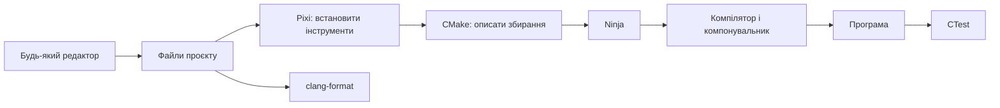
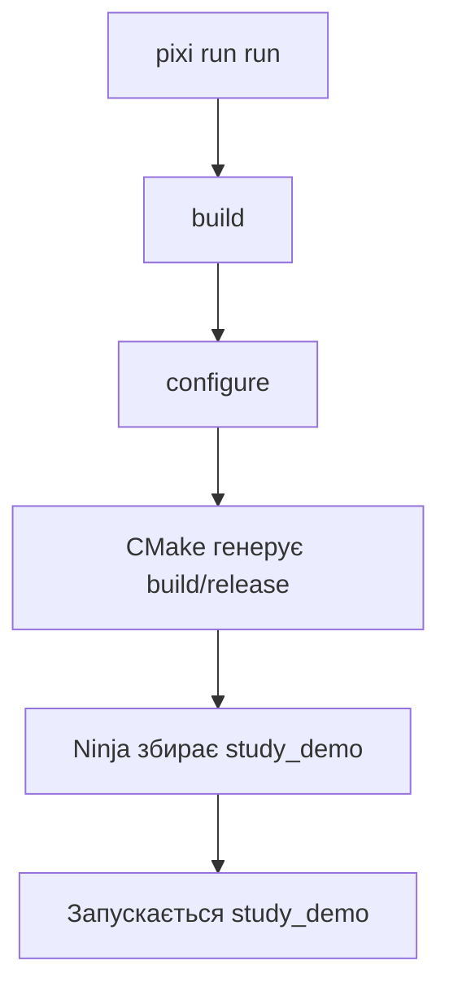
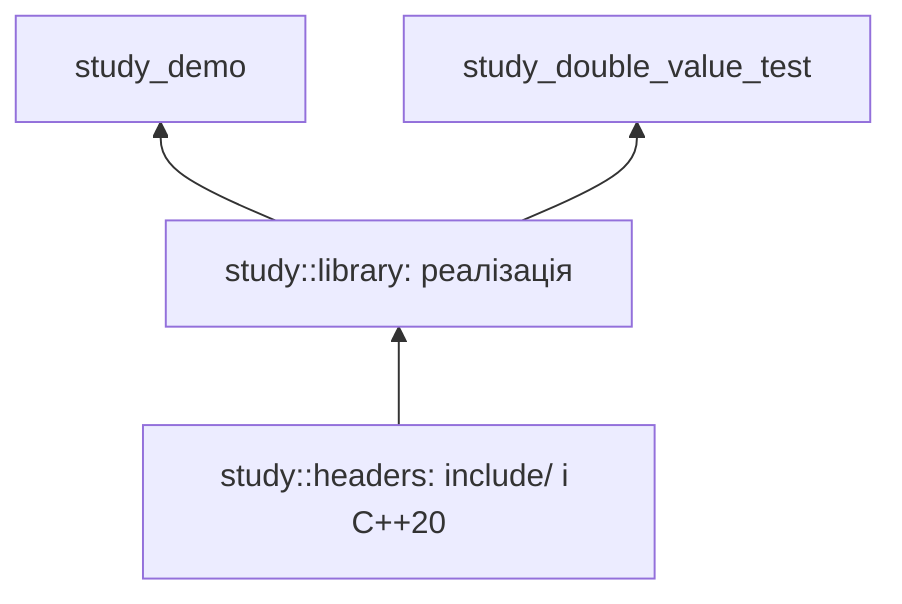

# Навчальний посібник: C++ оточення, яке запускається з термінала

**Мови:** [English](STUDY.md) · Українська

> Мета: самостійно написати кілька звичайних текстових файлів, отримати компілятор та інструменти через Pixi й збирати проєкт однією командою. Підійде будь-який редактор: Блокнот, Vim, Emacs, Kate, Sublime Text або інший звичний інструмент. VS Code для цього процесу не потрібний.

Посібник розрахований на людину, яка вже вміє написати маленьку програму на C++, але ще не знає, як передати її іншій людині разом із робочим оточенням для збирання. Кожен етап додає одну зрозумілу можливість. Першу програму можна зібрати після розділу 4; решта розділів поступово знайомить із рішеннями, які використовує Rangeforge.

**Тут є два різні проєкти:** `study-cpp` — навчальний приклад, який ви створюєте в окремій папці; Rangeforge — наявний репозиторій, на якому пояснюються подальші рішення. Не замінюйте файли Rangeforge прикладами з початкових розділів.

## Зміст

1. [Що саме ми хочемо відтворювати](#part-1)
2. [Як користуватися готовим оточенням Rangeforge](#part-2)
3. [Створюємо порожній навчальний проєкт](#part-3)
4. [Три файли й перше збирання](#part-4)
5. [Навіщо потрібний lockfile](#part-5)
6. [Додаємо бібліотеку, заголовки й тест](#part-6)
7. [Робимо команди зручними через tasks](#part-7)
8. [Налаштовуємо форматування](#part-8)
9. [Прив’язуємо опції до targets](#part-9)
10. [Спрощуємо кореневий CMake](#part-10)
11. [Як працювати з lint і Python](#part-11)
12. [Bootstrap: оточення після клонування](#part-12)
13. [Та сама команда в GitHub Actions](#part-13)
14. [Щоденна робота й діагностика](#part-14)
15. [Що означає «готово до передавання»](#part-15)
16. [Практичні завдання](#part-16)

<a id="part-1"></a>

## 1. Що саме ми хочемо відтворювати

Уявіть лабораторну роботу: студент написав `main.cpp` і надіслав викладачеві. Щоб її запустити, викладачеві ще потрібно знати:

- який компілятор і стандарт C++ використовувати;
- які бібліотеки та інструменти встановити;
- яку команду виконати;
- як перевірити результат;
- які версії залежностей використовував автор.

Оточення стає plug-and-play, коли відповіді зберігаються в репозиторії, а коротка інструкція пояснює початок роботи.

```text
Репозиторій                        Після встановлення
──────────────────────────         ───────────────────────────
вихідний код                   →   вихідний код залишається на місці
pixi.toml: вимоги               →   .pixi/envs/default/: інструменти
pixi.lock: вибрані пакети       →   встановлені версії пакетів
CMakeLists.txt: цілі збирання   →   build/: об’єкти та програми
tasks: команди                  →   pixi run build / test / check
```

### Хто за що відповідає

| Інструмент | Що робить | Що ви пишете самостійно |
| --- | --- | --- |
| Редактор | Дає змогу змінювати текст | Вихідний код і конфігурацію |
| Pixi | Встановлює залежності й запускає команди в оточенні | `pixi.toml` |
| CMake | Описує targets і генерує систему збирання | `CMakeLists.txt` |
| Ninja | Виконує потрібні кроки збирання | Зазвичай нічого: файли генерує CMake |
| Компілятор C++ | Перетворює вихідні файли на об’єктні | Код C++ |
| Компонувальник | Поєднує об’єкти й бібліотеки в програму | Зв’язки між targets у CMake |
| CTest | Запускає зареєстровані перевірки | `add_test(...)` |
| clang-format | Перевіряє та застосовує оформлення C++ | `.clang-format` |
| Git | Зберігає код, конфігурацію та історію | Змістовні коміти |
| GitHub Actions | Виконує команди на окремій машині | Workflow у `.github/workflows/` |

**Редактор не є частиною ланцюжка збирання.** Після збереження файлу всі потрібні дії доступні з термінала.



Якщо ваш переглядач Markdown не показує Mermaid, запам’ятайте короткий ланцюжок: **Pixi → CMake → Ninja → компілятор → програма**.

### Що означає відтворюваність у цьому посібнику

Ми фіксуємо пакети інструментів і записуємо команди для підтримуваних платформ. Це не обіцянка однакових байтів виконуваного файлу на різних ОС. До самої машини залишаються вимоги: відповідна архітектура, операційна система, системні бібліотеки та, для деяких toolchain, SDK. Для першого встановлення потрібний доступ до джерел пакетів.

<a id="part-2"></a>

## 2. Як користуватися готовим оточенням Rangeforge

Якщо ви просто хочете працювати в цьому репозиторії, створення навчального проєкту можна відкласти.

### Windows x86-64, PowerShell

Відкрийте термінал у корені репозиторію:

```powershell
.\scripts\bootstrap.ps1
.\.pixi\bin\pixi.exe run check
```

### Linux x86-64 і macOS на Apple Silicon

```sh
sh scripts/bootstrap.sh
./.pixi/bin/pixi run check
```

Скрипти завантажують зафіксований реліз Pixi, перевіряють SHA-256 і виконують `install --locked`. Для цього процесу не потрібно окремо встановлювати Python, Node.js, CMake або компілятор. Потрібні засоби запуску самого bootstrap: PowerShell у Windows або shell та утиліти завантаження й перевірки хешу в Unix.

Тут підтримуються `win-64`, `linux-64` і `osx-arm64`. Для Intel Mac або Linux ARM треба окремо розширити manifest і bootstrap.

### Що робить `check` у Rangeforge

```text
check
├── format-check                         clang-format
├── test
│   └── build
│       └── configure                    CMake → Ninja
└── rf001                                правило розділення оголошень
```

Команда охоплює перевірку оформлення, збирання, три перевірки CTest і RF001. Дерево показує залежності; порядок незалежних гілок не варто вважати контрактом.

Виконувані файли тестів зараз з’являються в `build/ninja-release/test/`, а бібліотека реалізацій — у `build/ninja-release/src/`. Тести зручно запускати через CTest, який знає розташування їхніх файлів.

<a id="part-3"></a>

## 3. Створюємо порожній навчальний проєкт

Далі працюємо **в новій папці `study-cpp`**, окремо від Rangeforge.

### Створіть папку

Windows:

```powershell
New-Item -ItemType Directory study-cpp
Set-Location study-cpp
New-Item -ItemType Directory src
```

Linux/macOS:

```sh
mkdir -p study-cpp/src
cd study-cpp
```

Зберігайте файли як звичайний текст UTF-8. У Windows увімкніть показ розширень: `pixi.toml.txt` і `CMakeLists.txt.txt` не будуть розпізнані як потрібні файли конфігурації.

### Отримайте один інструмент: Pixi

Для вправи достатньо встановленого Pixi, доступного як `pixi` в терміналі. Виберіть спосіб з [офіційної інструкції встановлення](https://pixi.prefix.dev/latest/installation/).

Можна використати локальний виконуваний файл:

1. Відкрийте [реліз Pixi v0.81.0](https://github.com/prefix-dev/pixi/releases/tag/v0.81.0), який використовує bootstrap цього репозиторію.
2. Завантажте файл для своєї ОС та архітектури.
3. Помістіть його в `study-cpp/.pixi/bin/` під назвою `pixi.exe` у Windows або `pixi` в Unix.
4. Для Unix надайте право на виконання: `chmod +x .pixi/bin/pixi`.
5. Перевірте версію: `./.pixi/bin/pixi --version` або `.\.pixi\bin\pixi.exe --version`.

| Система | Файл у зазначеному релізі |
| --- | --- |
| Windows x86-64 | `pixi-x86_64-pc-windows-msvc.exe` |
| Linux x86-64 | `pixi-x86_64-unknown-linux-musl` |
| macOS ARM64 | `pixi-aarch64-apple-darwin` |

Частина `msvc` у назві Windows файлу описує збирання самого Pixi. Компілятор вашого навчального C++ проєкту вибирається окремо в manifest.

Щоб у наступних прикладах писати коротке `pixi`, додайте локальну папку **лише до поточного сеансу термінала**.

PowerShell:

```powershell
$studyPixiBin = (Resolve-Path .pixi/bin).Path
$env:PATH = "$studyPixiBin;$env:PATH"
pixi --version
```

Unix shell:

```sh
export PATH="$(pwd)/.pixi/bin:$PATH"
pixi --version
```

Після відкриття нового термінала повторіть налаштування або використовуйте повний шлях до локального Pixi. Глобально змінювати `PATH` для вправи не потрібно.

<a id="part-4"></a>

## 4. Три файли й перше збирання

### Файл 1: `src/main.cpp`

```cpp
#include <iostream>

int main() {
    std::cout << "Hello from a reproducible C++ environment!\n";
    return 0;
}
```

### Файл 2: `CMakeLists.txt`

```cmake
cmake_minimum_required(VERSION 3.28)
project(study LANGUAGES CXX)

add_executable(study_demo src/main.cpp)
target_compile_features(study_demo PRIVATE cxx_std_20)
```

Пояснення кожного рядка:

| Рядок | Значення |
| --- | --- |
| `cmake_minimum_required(...)` | Задає мінімальну версію та відповідні політики CMake |
| `project(... LANGUAGES CXX)` | Оголошує проєкт і вмикає підтримку компілятора C++ |
| `add_executable(...)` | Створює target програми із зазначеного вихідного файлу |
| `target_compile_features(...)` | Вимагає C++20 для цього target |

**Target** — іменований об’єкт збирання: програма, бібліотека або набір вимог. Ми описуємо `study_demo`, а команди компілятора формує CMake.

### Файл 3: `pixi.toml`

```toml
[workspace]
name = "study-cpp"
channels = ["conda-forge"]
platforms = ["win-64", "linux-64", "osx-arm64"]

[dependencies]
cmake = ">=3.28"
ninja = "*"

[target.win-64.dependencies]
gcc_win-64 = "*"
gxx_win-64 = "*"

[target.linux-64.dependencies]
compilers = "*"

[target.osx-arm64.dependencies]
compilers = "*"

[tasks]
configure = "cmake -S . -B build/release -G Ninja -DCMAKE_BUILD_TYPE=Release"
build = { cmd = "cmake --build build/release", depends-on = ["configure"] }
run = { cmd = "build/release/study_demo", depends-on = ["build"] }
```

Manifest містить три групи інформації:

```text
workspace       Де шукати пакети та які платформи підтримувати
dependencies    Які інструменти потрібні
tasks           Які команди запускати
```

`*` дозволяє будь-яку сумісну версію під час розв’язання залежностей. Конкретні вибрані пакети будуть записані в lockfile. Для Windows тут використовується MinGW-w64, для Linux і macOS — відповідні пакети компіляторів conda-forge.

### Тепер виконайте

```sh
pixi install
pixi run run
```

Очікуваний результат — рядок із `main.cpp` у терміналі. Перед ним з’являться повідомлення встановлення, конфігурації та збирання.



### Що означають аргументи CMake

```sh
cmake -S . -B build/release -G Ninja -DCMAKE_BUILD_TYPE=Release
```

| Аргумент | Значення |
| --- | --- |
| `-S .` | Вихідні файли знаходяться в поточній папці |
| `-B build/release` | Згенеровані файли потрапляють в окрему папку |
| `-G Ninja` | Генератор створює файли для Ninja |
| `-DCMAKE_BUILD_TYPE=Release` | Вибираємо Release для звичайного генератора Ninja в цьому прикладі |

`cmake --build build/release` викликає вибрану систему збирання. Не потрібно вручну писати окрему команду `g++` для кожного файлу.

У результаті папка містить:

```text
study-cpp/
├── src/main.cpp              написаний вами
├── CMakeLists.txt            написаний вами
├── pixi.toml                 написаний вами
├── pixi.lock                 створений Pixi
├── .pixi/                    встановлені інструменти
└── build/release/            згенеровані файли й результати збирання
```

### Додайте `.gitignore`

```gitignore
/.pixi/
/build/
```

Вихідний код, manifest і lockfile мають потрапити до Git. Завантажені інструменти й результати збирання можна відновити; зберігати їх в історії не потрібно.

<a id="part-5"></a>

## 5. Навіщо потрібний lockfile

`pixi.toml` і `pixi.lock` відповідають на різні запитання:

| Файл | Запитання | Приклад |
| --- | --- | --- |
| `pixi.toml` | Що підходить проєкту? | CMake не старіший за 3.28 |
| `pixi.lock` | Що конкретно було вибрано? | Певний пакет CMake та його залежності для кожної платформи |

Звичайний `pixi install` може розв’язати залежності й оновити lockfile. `pixi install --locked` вимагає узгодженості manifest і lockfile та завершується помилкою, якщо lockfile застарів. Це зручно для отримання вже підготовленого проєкту. [Довідка `pixi install`](https://pixi.prefix.dev/latest/reference/cli/pixi/install/)

### Робота автора проєкту

Після зміни вимог:

```sh
pixi lock
pixi install --locked
git diff -- pixi.toml pixi.lock
```

Перегляньте зміни пакетів, а потім збережіть manifest і lockfile в одному коміті.

### Робота іншого студента

Після отримання проєкту:

```sh
pixi install --locked
pixi run --locked run
```

`--locked` у `run` також не дасть непомітно вибрати нові залежності. Звичайний `pixi run` може встановлювати оточення й оновлювати lockfile за потреби. [Довідка `pixi run`](https://pixi.prefix.dev/latest/reference/cli/pixi/run/)

**Не плутайте `--locked` і `--frozen`.** `--frozen` використовує lockfile без перевірки відповідності manifest; це не заміна перевірці узгодженості в навчальному CI.

### Чому недостатньо надіслати лише `.pixi/`

Встановлене оточення містить файли для конкретної платформи й може залежати від шляху встановлення. Отримувач має відновити його через Pixi. Передавайте конфігурацію, lockfile, вихідний код та інструкції bootstrap.

Lockfile фіксує пакети окремо для підтримуваних платформ; він не перетворює Windows програму на Linux програму. [Документація lockfile](https://pixi.prefix.dev/latest/workspace/lock_file/)

<a id="part-6"></a>

## 6. Додаємо бібліотеку, заголовки й тест

Тепер перетворимо окрему програму на маленький проєкт із бібліотекою. **Замініть** навчальні `CMakeLists.txt` і `src/main.cpp`, створіть три нові файли.

```text
study-cpp/
├── include/study/double_value.hpp
├── src/double_value.cpp
├── src/main.cpp
├── test/double_value.cpp
├── CMakeLists.txt
├── pixi.toml
└── pixi.lock
```

Створіть відсутні папки засобами своєї ОС або редактора.

### Публічний заголовок: `include/study/double_value.hpp`

```cpp
#pragma once

namespace study {

int double_value(int value);

} // namespace study
```

### Реалізація: `src/double_value.cpp`

```cpp
#include <study/double_value.hpp>

namespace study {

int double_value(int value) {
    return value * 2;
}

} // namespace study
```

Навчальна функція припускає, що результат множення можна подати в `int`. Для промислової функції потрібно окремо визначити діапазон вхідних даних або обробку переповнення.

### Програма: новий `src/main.cpp`

```cpp
#include <study/double_value.hpp>

#include <iostream>

int main() {
    std::cout << study::double_value(21) << '\n';
    return 0;
}
```

### Перевірка: `test/double_value.cpp`

```cpp
#include <study/double_value.hpp>

int main() {
    if (study::double_value(21) != 42)
        return 1;
    if (study::double_value(0) != 0)
        return 1;
    if (study::double_value(-3) != -6)
        return 1;
    return 0;
}
```

CTest розуміє коди виходу: `0` — успіх, ненульовий код — помилка. Тут навмисно використовується явний `return`, щоб перевірка працювала й у Release, де звичайний `assert` може бути вимкнений через `NDEBUG`.

### Новий `CMakeLists.txt`

```cmake
cmake_minimum_required(VERSION 3.28)
project(study LANGUAGES CXX)

include(CTest)

add_library(study_headers INTERFACE)
add_library(study::headers ALIAS study_headers)
target_compile_features(study_headers INTERFACE cxx_std_20)
target_sources(study_headers INTERFACE
  FILE_SET HEADERS
  BASE_DIRS include
  FILES include/study/double_value.hpp
)

add_library(study_library STATIC src/double_value.cpp)
add_library(study::library ALIAS study_library)
target_link_libraries(study_library PUBLIC study::headers)

add_executable(study_demo src/main.cpp)
target_link_libraries(study_demo PRIVATE study::library)

if(BUILD_TESTING)
  add_executable(study_double_value_test test/double_value.cpp)
  target_link_libraries(study_double_value_test PRIVATE study::library)
  add_test(NAME study_double_value COMMAND study_double_value_test)
endif()
```

### Розбираємо зв’язки



Target `INTERFACE` тут не компілює окремий `.cpp`: він передає вимоги споживачам. Target `STATIC` створює архів об’єктних файлів реалізації. `ALIAS` дає зручну назву наявному target і не створює другу бібліотеку.

| Вид зв’язку | Вимога застосовується до самого target? | Передається споживачам? |
| --- | --- | --- |
| `PRIVATE` | Так | Ні для звичайних вимог компіляції |
| `PUBLIC` | Так | Так |
| `INTERFACE` | Ні | Так |

Бібліотека використовує свій публічний заголовок і передає його include directory програмі, тому зв’язок зі `study::headers` — `PUBLIC`. Програма використовує бібліотеку для власного збирання, тому її зв’язок — `PRIVATE`. Для статичних бібліотек CMake також зберігає залежності, потрібні для фінального компонування; таблиця не означає, що `PRIVATE` завжди повністю зникає з link graph. [Довідка `target_link_libraries`](https://cmake.org/cmake/help/v3.28/command/target_link_libraries.html)

### Що дає `FILE_SET HEADERS`

Ми явно перелічили публічний заголовок і кореневу папку include. Для header set з областю `INTERFACE` CMake додає `BASE_DIRS` до include requirements споживачів у дереві збирання. Додатковий `target_include_directories` для тієї самої папки в цьому прикладі не потрібний. Пізніше набір можна використати для встановлення й експорту. [Документація file sets](https://cmake.org/cmake/help/v3.28/command/target_sources.html#file-sets)

Сама назва `study::headers` не робить проєкт установленим CMake package. Зараз програма використовує targets усередині одного збирання.

### Що дає `include(CTest)`

Модуль створює стандартну опцію `BUILD_TESTING` і вмикає підтримку тестування, коли ця опція ввімкнена. У звичайній конфігурації вона ввімкнена за замовчуванням. [Документація CTest](https://cmake.org/cmake/help/v3.28/module/CTest.html)

Додайте рядок до наявного розділу `[tasks]` навчального `pixi.toml`:

```toml
test = { cmd = "ctest --test-dir build/release --output-on-failure", depends-on = ["build"] }
```

Тепер можна виконати:

```sh
pixi run run
pixi run test
```

Програма має надрукувати `42`, а CTest — повідомити про успішну перевірку `study_double_value`.

Для окремого збирання без тестів:

```sh
pixi run cmake -S . -B build/library -G Ninja -DCMAKE_BUILD_TYPE=Release -DBUILD_TESTING=OFF
pixi run cmake --build build/library
```

`pixi run cmake ...` запускає інструмент з оточення; окремий task для кожної разової команди не обов’язковий.

<a id="part-7"></a>

## 7. Робимо команди зручними через tasks

Команда має описувати намір: зібрати, запустити або перевірити. Збережіть довгі аргументи в manifest, щоб їх не доводилося запам’ятовувати.

Після розділу 6 весь розділ `[tasks]` навчального проєкту виглядає так:

```toml
[tasks]
configure = "cmake -S . -B build/release -G Ninja -DCMAKE_BUILD_TYPE=Release"
build = { cmd = "cmake --build build/release", depends-on = ["configure"] }
run = { cmd = "build/release/study_demo", depends-on = ["build"] }
test = { cmd = "ctest --test-dir build/release --output-on-failure", depends-on = ["build"] }
```

Не створюйте другий `[tasks]`: доповнюйте або замінюйте наявний розділ.

### `depends-on` оголошує залежності

```text
pixi run test
     │
     ├─ configure: підготувати систему збирання
     ├─ build: зібрати відсутні або змінені файли
     └─ test: виконати перевірки
```

Запуск `test` автоматично охоплює потрібні попередні кроки. Повторний запуск `build` не означає повну перекомпіляцію: Ninja визначає, які результати застаріли.

Pixi tasks утворюють граф залежностей. Завдання без власної команди може об’єднувати кілька завдань — наприклад, `check`. [Документація tasks](https://pixi.prefix.dev/latest/workspace/advanced_tasks/)

Корисні команди для вивчення manifest:

```sh
pixi task list
pixi task --help
pixi run --help
```

### Одна команда для вас і того, хто перевіряє роботу

Коли нижче з’явиться `format-check`, додайте:

```toml
check = { depends-on = ["format-check", "test"] }
```

`check` не мусить містити власну shell command. Вона означає, що всі зазначені перевірки мають успішно завершитися.

Довші програми автоматизації зберігайте в окремих файлах і викликайте з tasks. Manifest залишається зрозумілою картою команд.

<a id="part-8"></a>

## 8. Налаштовуємо форматування

Тепер додамо до навчального проєкту одне автоматичне правило якості: однакове оформлення вихідного коду.

### Крок 1. Встановіть інструмент через manifest

До наявного `[dependencies]` додайте:

```toml
clang-format = "21.*"
```

Потім оновіть залежності:

```sh
pixi lock
pixi install --locked
```

### Крок 2. Створіть `.clang-format`

```yaml
BasedOnStyle: LLVM
IndentWidth: 4
ColumnLimit: 100
```

Це політика оформлення навчального проєкту. У наявному Rangeforge використовуйте його `.clang-format`.

### Крок 3. Створіть `tools/check-format.cmake`

```cmake
set(study_cpp_files)
foreach(directory IN ITEMS src include test)
  file(GLOB_RECURSE directory_files
    "${CMAKE_CURRENT_LIST_DIR}/../${directory}/*.cpp"
    "${CMAKE_CURRENT_LIST_DIR}/../${directory}/*.hpp"
  )
  list(APPEND study_cpp_files ${directory_files})
endforeach()

if(NOT study_cpp_files)
  message(FATAL_ERROR "No C++ files found.")
endif()

execute_process(
  COMMAND clang-format --dry-run --Werror ${study_cpp_files}
  RESULT_VARIABLE format_result
)
if(NOT format_result EQUAL 0)
  message(FATAL_ERROR "Formatting check failed.")
endif()
```

У цьому прикладі шукаємо лише `.cpp` і `.hpp` у трьох папках. Якщо використовуєте інші розширення або додаєте `examples/`, явно розширте список.

`CMAKE_CURRENT_LIST_DIR` — папка самого скрипту. Це дає змогу будувати шляхи відносно його розташування.

### Крок 4. Додайте tasks

До наявного `[tasks]` додайте:

```toml
format-check = "cmake -P tools/check-format.cmake"
check = { depends-on = ["format-check", "test"] }
```

І виконайте:

```sh
pixi run format-check
pixi run check
```

Щоб застосувати оформлення до одного файлу:

```sh
pixi run clang-format -i src/main.cpp
```

`--dry-run --Werror` перевіряє оформлення, `-i` змінює файл. Після форматування перегляньте diff.

### Чому тут доречний `GLOB_RECURSE`

Скрипт перевірки щоразу заново знаходить файли. Для такого разового обходу це зручно. Вихідні файли й публічні заголовки targets у навчальному проєкті перелічені явно: ці списки є частиною опису програми.

CMake має різні режими роботи:

```text
cmake -S . -B build/release     конфігурація проєкту
cmake --build build/release    запуск збирання
cmake -P tools/check-format.cmake
                               виконання окремого скрипту
```

У Rangeforge була реальна помилка: `CONFIGURE_DEPENDS` використовували у `file(GLOB_RECURSE ...)` всередині скрипту, який запускався через `cmake -P`. Цей режим не підтримує такої опції, тому всі платформи CI зупинялися на першому кроці. Висновок: знайома команда CMake не обов’язково допустима в кожному режимі роботи.

<a id="part-9"></a>

## 9. Прив’язуємо опції до targets

Із цього розділу розбираємо **наявну структуру Rangeforge**. Навчальний проєкт уже працює. Переносьте наведені прийоми за потреби, замінюючи назви targets на власні.

Коли цілей стає кілька, корисно відокремити публічні вимоги бібліотеки від внутрішніх налаштувань розробки.

```text
Публічний контракт бібліотеки       Налаштування розробки проєкту
───────────────────────────        ──────────────────────────────
include directories                санітайзери
C++20                              запуск clang-tidy
публічні залежності                інші внутрішні перевірки
```

### Окремий target для project options

У [cmake/ProjectOptions.cmake](cmake/ProjectOptions.cmake) є:

```cmake
add_library(rangeforge_project_options INTERFACE)
```

Коли санітайзери ввімкнені, їхні вимоги додаються саме до нього:

```cmake
target_compile_options(rangeforge_project_options INTERFACE
  -fsanitize=address,undefined -fno-omit-frame-pointer
)
target_link_options(rangeforge_project_options INTERFACE
  -fsanitize=address,undefined
)
```

Потім проєктний target підключає їх:

```cmake
target_link_libraries(rangeforge_solutions PRIVATE rangeforge_project_options)
```

Для санітайзерів тут потрібні дві складові: інструментація під час компіляції та підтримка під час фінального компонування. У Rangeforge options target підключений і до бібліотеки реалізацій, і до виконуваних targets тестів.

Внутрішні налаштування не додаються до публічного header-only target `rangeforge`. Звичайний споживач заголовків отримує include directory та вимогу C++20.

### Чому варто уникати глобальних команд

Глобальні `add_compile_options`, `add_link_options` і налаштування `CMAKE_CXX_CLANG_TIDY` поширюються через область каталогу та значення за замовчуванням. Коли з’являються сторонні бібліотеки й різні режими збирання, складніше побачити, які targets вони зачіпають.

Налаштування target робить це помітним поруч із його описом:

```cmake
rangeforge_apply_project_options(rangeforge_solutions)
```

### clang-tidy призначається конкретному target

```cmake
set_property(TARGET rangeforge_solutions PROPERTY CXX_CLANG_TIDY
  "${RANGEFORGE_CLANG_TIDY_EXE};--config-file=${PROJECT_SOURCE_DIR}/.clang-tidy"
)
```

Ця властивість target запускає аналіз під час збирання. У Rangeforge призначення винесене до `rangeforge_apply_project_options`, щоб бібліотека й тести отримували однакове налаштування без копіювання рядків.

### Як увімкнути аналіз

Rangeforge має preset `release-lint`. Запустіть CMake з оточення Pixi:

```sh
pixi run cmake --preset release-lint
pixi run cmake --build --preset release-lint
```

Preset зберігає параметри конфігурації, а Pixi надає інструменти. Сам preset не встановлює компілятор або `clang-tidy`.

### Як увімкнути санітайзери

Для передбаченого в Rangeforge Linux workflow:

```sh
pixi run test-sanitize
```

Він використовує окрему папку збирання `build/ninja-sanitize`. Не сприймайте цю команду як готовий sanitizer workflow для Windows: доступність runtime і підтримка toolchain відрізняються між платформами.

Для іншого компілятора або режиму інструментації створюйте окрему папку збирання. Усередині `build/` уже є cache CMake та результати визначення toolchain.

<a id="part-10"></a>

## 10. Спрощуємо кореневий CMake

Поділ файлів корисний, коли проєкт уже має кілька частин. Для програми з одного файлу достатньо CMake з розділу 4.

### Карта Rangeforge

```text
CMakeLists.txt                    поєднує частини проєкту
cmake/ProjectOptions.cmake        задає внутрішні опції
include/CMakeLists.txt            описує публічні заголовки
src/CMakeLists.txt                описує бібліотеку реалізацій
test/CMakeLists.txt               створює та реєструє тести
```

Корінь залишається коротким:

```cmake
cmake_minimum_required(VERSION 3.28)
project(rangeforge LANGUAGES CXX)

include(CTest)
include(cmake/ProjectOptions.cmake)

add_subdirectory(include)
add_subdirectory(src)

if(BUILD_TESTING)
  add_subdirectory(test)
endif()
```

Порядок підключення важливий: опції й публічний target створюються до targets, які їх використовують.

### Публічні заголовки

[include/CMakeLists.txt](include/CMakeLists.txt):

```cmake
add_library(rangeforge INTERFACE)
add_library(rangeforge::rangeforge ALIAS rangeforge)

target_compile_features(rangeforge INTERFACE cxx_std_20)
target_sources(rangeforge INTERFACE
  FILE_SET HEADERS
  BASE_DIRS "${CMAKE_CURRENT_SOURCE_DIR}"
  FILES
    rangeforge/solutions.hpp
    rangeforge/subset_average_oracle.hpp
    rangeforge/test.hpp
    rangeforge/types.hpp
)
```

Тут `CMAKE_CURRENT_SOURCE_DIR` уже вказує на `include/`, бо файл виконується через `add_subdirectory(include)`.

### Реалізації

[src/CMakeLists.txt](src/CMakeLists.txt):

```cmake
add_library(rangeforge_solutions STATIC
  maximum_deletions_balanced.cpp
  maximum_deletions_packed.cpp
)
add_library(rangeforge::solutions ALIAS rangeforge_solutions)

target_link_libraries(rangeforge_solutions PUBLIC rangeforge::rangeforge)
rangeforge_apply_project_options(rangeforge_solutions)
```

У `src/` шляхи до вихідних файлів також задаються відносно цього підкаталогу.

### Функція для повторюваного налаштування тестів

[test/CMakeLists.txt](test/CMakeLists.txt):

```cmake
function(rangeforge_add_test name source library)
  set(target "rangeforge_${name}_test")
  add_executable(${target} ${source})
  target_link_libraries(${target} PRIVATE ${library})
  rangeforge_apply_project_options(${target})
  add_test(NAME "rangeforge_${name}" COMMAND ${target})
endfunction()

rangeforge_add_test(differential differential.cpp rangeforge::solutions)
rangeforge_add_test(oracle oracle.cpp rangeforge::rangeforge)
rangeforge_add_test(mutation mutation_test.cpp rangeforge::rangeforge)
```

Функція корисна, бо чотири дії повторюються з невеликими відмінностями. Вона не має перетворюватися на окрему мову конфігурації: параметри залишаються зрозумілими — назва, вихідний файл і бібліотека.

### Мінімальна версія CMake узгоджується в трьох місцях

| Місце | Що зберігає |
| --- | --- |
| `CMakeLists.txt` | `cmake_minimum_required(VERSION 3.28)` |
| `CMakePresets.json` | `cmakeMinimumRequired` із minor `28` |
| `pixi.toml` | `cmake = ">=3.28"` |

Після зміни вимог оновіть lockfile. Якщо вибраний пакет CMake уже підходить, вміст lockfile може не змінитися — це нормально.

<a id="part-11"></a>

## 11. Як працювати з lint і Python

Розрізняйте інструменти за їхніми завданнями:

| Перевірка | Що бачить | Що перевіряє |
| --- | --- | --- |
| clang-format | Структуру тексту C++ для оформлення | Відступи, переноси та пробіли |
| clang-tidy | Код і семантичну інформацію Clang | Вибрані перевірки помилок та якості коду |
| RF001 у Rangeforge | AST через libclang | Порожній рядок після групи оголошень |
| CTest | Результати виконання програм | Перевірювану поведінку алгоритмів |

### Почніть із готового інструмента

Для звичайного оформлення достатньо `clang-format`. Для статичного аналізу спочатку перегляньте наявні checks `clang-tidy`. Власне правило доречне, коли проєкт має конкретну вимогу, яку вибрані готові перевірки не охоплюють.

### Приклад RF001

Порушення проєктного правила:

```cpp
int result = 0;
int step = 2;
result += step;
```

Розділені групи:

```cpp
int result = 0;
int step = 2;

result += step;
```

Це фрагменти тіла функції, а не самостійні `.cpp` файли. Коментар між групами не замінює порожній рядок.

### Чому правило використовує Clang

Оголошення C++ може займати кілька рядків і містити шаблони, лямбди та макроси. У Rangeforge Clang розбирає код, а [tools/lint/rf001.py](tools/lint/rf001.py) порівнює сусідні вузли `DeclStmt` та інші statements усередині `CompoundStmt`. Скрипт реалізує правило проєкту; мову розбирає LLVM.

```text
Вихідний код C++
    ↓
libclang: препроцесор і AST
    ↓
Python bindings: доступ до вузлів
    ↓
RF001: перевірка проміжку між statements
    ↓
файл:рядок + повідомлення + код виходу
```

### Залежності саме для цього правила

У поточному manifest Rangeforge:

```toml
[dependencies]
python = ">=3.13"
clang = "21.*"
libclang13 = "21.*"

[pypi-dependencies]
clang = "==21.1.7"
```

Це фрагмент наявного manifest. Якщо переносите його до власного проєкту, об’єднайте записи з наявними розділами.

| Пакет | Призначення |
| --- | --- |
| `python` із conda-forge | Запускає скрипт |
| `clang` із conda-forge | Драйвер, який повідомляє шляхи заголовків toolchain |
| `libclang13` із conda-forge | Нативна бібліотека Clang C API |
| `clang` із PyPI | Python bindings для доступу до C API |

Схожі назви позначають різні шари. `libclang13` — назва пакета conda; зазначена тут версія — LLVM 21. Python bindings із PyPI не є компілятором і не постачають нативну бібліотеку. [Опис пакета bindings](https://pypi.org/project/clang/)

Parser, bindings і builtin headers потребують сумісних версій. Manifest і lockfile фіксують цей вибір. Власну таблицю C-функцій і завантажувач DLL/so у Rangeforge видалено; бібліотеку завантажують bindings LLVM після отримання її розташування в оточенні.

### Як правило входить до workflow

```toml
rf001 = "python tools/lint/rf001.py ."
lint = { depends-on = ["rf001"] }
check = { depends-on = ["format-check", "test", "rf001"] }
```

RF001 не залежить від збирання CMake. Запуск:

```sh
pixi run rf001
```

| Код виходу RF001 | Значення |
| --- | --- |
| `0` | Перевірка завершилася без порушень |
| `1` | Знайдено порушення правила |
| `2` | Помилка налаштування або розбору вихідного коду |

Якщо Clang не зміг розібрати файл, це не успішна перевірка стилю. Спочатку виправте конфігурацію toolchain або вихідний код.

### Окреме оточення для досліджень

Rangeforge зберігає наукові пакети в додатковому feature:

```toml
[feature.research.dependencies]
numpy = "*"
scipy = "*"
pandas = "*"
matplotlib = "*"
ipython = "*"

[environments]
default = ["default"]
research = ["default", "research"]
```

`research` поєднує базові залежності з додатковими пакетами. У поточному проєкті Python уже входить до базового оточення для lint.

```sh
pixi run -e research python
```

Отже, дослідницькі залежності не потрібні для звичайного збирання й lint у базовому оточенні.

<a id="part-12"></a>

## 12. Bootstrap: оточення після клонування

Ми вже маємо залежності й команди. Залишилося одне запитання першого запуску: як отримувач дістане сам Pixi?

**Bootstrap** — маленький стартовий скрипт, який встановлює інструмент, потрібний для встановлення решти інструментів.

### Достатній алгоритм

```text
1. Знайти корінь репозиторію відносно самого скрипту
2. Вибрати виконуваний файл Pixi для поточної ОС та архітектури
3. Завантажити конкретний реліз до тимчасового файлу
4. Порівняти SHA-256 з очікуваним значенням
5. Перемістити перевірений файл до .pixi/bin/
6. Запустити локальний Pixi: install --locked
7. Надрукувати команду для подальшої роботи
```

### Використайте невеликі готові скрипти

До навчального проєкту можна скопіювати два файли з цього репозиторію:

- [scripts/bootstrap.ps1](scripts/bootstrap.ps1) для Windows;
- [scripts/bootstrap.sh](scripts/bootstrap.sh) для Linux x86-64 і macOS ARM64.

Збережіть їх у `study-cpp/scripts/` під тими самими назвами. Змініть лише фінальне інформаційне повідомлення: замість Rangeforge вкажіть `study-cpp`, а командою запуску зробіть `run check`, яка з’явилася в розділі 8. Завантаження й встановлення стосуються Pixi та не залежать від назви C++ target.

Перед копіюванням прочитайте скрипти згори донизу. Кожен містить зафіксовану версію, URL, очікуваний хеш, шлях встановлення та виклик `install --locked`. Це звичайні текстові файли, які можна зрозуміти й змінювати самостійно.

Коли оновлюєте Pixi, разом оновлюйте версію, назву release asset, очікуваний SHA-256 і версію в CI. Новий URL зі старим хешем спричинить помилку перевірки.

### Що перевіряє SHA-256

Порівняння підтверджує, що завантажені байти відповідають очікуваному артефакту. Очікуване значення потрібно отримати з довіреного джерела й перевірити під час оновлення скрипту. Хеш, обчислений лише після випадкового завантаження й одразу прийнятий за еталон, не дає незалежної перевірки.

У Windows вручну переглянути хеш завантаженого файлу можна так:

```powershell
Get-FileHash -Algorithm SHA256 .pixi/bin/pixi.exe
```

У Linux:

```sh
sha256sum .pixi/bin/pixi
```

У macOS:

```sh
shasum -a 256 .pixi/bin/pixi
```

### Чому `install --locked`

Отримувач встановлює залежності, уже вибрані автором. Якщо автор змінив manifest і забув про lockfile, bootstrap має повідомити про помилку.

### Що залишиться локальним

Скрипти Rangeforge задають `PIXI_HOME` і `PIXI_CACHE_DIR` усередині `.pixi/` на час встановлення. Проте змінні, встановлені в окремому Unix процесі `sh scripts/bootstrap.sh`, не стають змінними батьківського термінала.

Якщо хочете зберегти такий самий cache path для наступних команд, явно задайте його у своєму сеансі.

PowerShell:

```powershell
$studyRoot = (Get-Location).Path
$env:PIXI_HOME = Join-Path $studyRoot '.pixi/home'
$env:PIXI_CACHE_DIR = Join-Path $studyRoot '.pixi/cache'
```

Unix:

```sh
export PIXI_HOME="$(pwd)/.pixi/home"
export PIXI_CACHE_DIR="$(pwd)/.pixi/cache"
```

Саме оточення проєкту знаходиться в `.pixi/envs/`. Локальне встановлення не означає, що весь процес працює офлайн: для порожнього cache потрібні завантаження. Git для клонування та базові засоби запуску bootstrap залишаються передумовами.

<a id="part-13"></a>

## 13. Та сама команда в GitHub Actions

У навчальному проєкті створіть `.github/workflows/ci.yml`:

```yaml
name: CI

on: [push, pull_request]

permissions:
  contents: read

jobs:
  check:
    runs-on: ${{ matrix.os }}
    timeout-minutes: 20
    strategy:
      fail-fast: false
      matrix:
        os: [ubuntu-latest, windows-latest, macos-15]
    steps:
      - uses: actions/checkout@v7.0.1
      - uses: prefix-dev/setup-pixi@v0.10.0
        with:
          pixi-version: v0.81.0
          locked: true
          cache: true
      - run: pixi run --locked check
```

Версії actions і Pixi взяті з поточного [workflow Rangeforge](.github/workflows/ci.yml). Це зафіксовані версії для цього посібника; оновлюйте їх окремою зміною. Приклад передбачає, що manifest, lockfile і task `check` із попередніх розділів уже збережені в репозиторії.

### Читайте workflow як послідовність дій

```text
checkout         отримати код і конфігурацію з Git
setup-pixi       отримати Pixi та встановити locked environment
run check        викликати той самий процес, доступний студенту
```

Matrix запускає незалежні jobs для різних runner images. Кожна ОС збирає власну програму. Три платформи в lockfile корисні, але успішне розв’язання залежностей саме по собі не доводить успішної компіляції на всіх трьох ОС.

### Що зберігати в конфігурації CI

Workflow містить умови запуску, runners і виклики команд проєкту. CMake та Pixi вже описують повні команди збирання; дублювання їх у YAML створює додаткове місце для розбіжностей.

### Коли додавати path filters

Початківцю простіше залишити запуск на кожен push і pull request. Коли додаватимете path filters, перелічіть усі шляхи, що впливають на збирання: `cmake/**`, CMake файли в підкаталогах, manifest, lockfile, вихідний код та інструменти перевірки.

У Rangeforge `cmake/**` додали до filters після винесення опцій. Інакше зміни налаштувань санітайзерів або clang-tidy могли б не запустити CI.

### Як читати помилку job

Шукайте перше повідомлення з конкретною причиною, а не лише останній рядок `Process completed with exit code 1`.

```text
Неправильне оформлення
    → зупинився format-check

Помилка CMake
    → не вдалося сконфігурувати папку збирання

Помилка C++
    → зупинилася компіляція

Ненульовий код тестової програми
    → CTest повідомляє про failed test

Помилка розбору в lint
    → не вдалося виконати повну перевірку вихідного коду
```

Якщо різні платформи падають на одному рядку скрипту до компіляції, почніть зі спільного скрипту. У попередній помилці Rangeforge всі jobs повідомляли про `CONFIGURE_DEPENDS`, тому спочатку виправили CMake script перевірки оформлення.

<a id="part-14"></a>

## 14. Щоденна робота й діагностика

### Звичайний цикл навчального проєкту

```text
відкрити термінал у корені проєкту
    ↓
змінити файл будь-яким редактором
    ↓
pixi run run або pixi run test
    ↓
виправити результат
    ↓
pixi run check
    ↓
переглянути git diff і зробити коміт
```

### Шпаргалка команд

Тут використовується коротке `pixi`. У Rangeforge без налаштування `PATH` замініть його на `.\.pixi\bin\pixi.exe` або `./.pixi/bin/pixi`.

| Завдання | Команда |
| --- | --- |
| Встановити отримане оточення | `pixi install --locked` |
| Переглянути команди проєкту | `pixi task list` |
| Зібрати | `pixi run build` |
| Запустити навчальну програму | `pixi run run` |
| Виконати тести | `pixi run test` |
| Перевірити оформлення | `pixi run format-check` |
| Виконати всі основні перевірки | `pixi run check` |
| Перерахувати lockfile після зміни manifest | `pixi lock` |
| Переглянути зміни перед комітом | `git diff` |
| Запустити інструмент з оточення | `pixi run cmake --version` |

### Як переконатися, що інструмент узятий з оточення

Переглядайте інструменти через Pixi:

```sh
pixi run cmake --version
pixi run ninja --version
```

Звичайна команда `cmake` поза Pixi може знайти інше встановлення. Вивід конфігурації CMake також показує ідентифікатор компілятора та його шлях. Це корисніше, ніж здогадки за списком установлених застосунків.

### Типові проблеми

| Симптом | Поширена причина | Перший крок |
| --- | --- | --- |
| `pixi` не знайдено | Локальний файл відсутній або не доданий до `PATH` | Використайте повний шлях, перегляньте bootstrap |
| CMake не знаходить проєкт | Інша папка або неправильна назва файлу | Перевірте корінь і точну назву `CMakeLists.txt` |
| Lockfile застарів | Manifest змінили окремо | Автор виконує `pixi lock` і зберігає обидва файли |
| CMake не знаходить компілятор | Команда запущена поза встановленим оточенням | Використовуйте `pixi run`, прочитайте configure log |
| Публічний заголовок не знайдено | Include requirements не передалися | Перевірте `FILE_SET HEADERS` і зв’язки targets |
| `undefined reference` / unresolved external | Реалізація не підключена до компонування | Перевірте target бібліотеки й `target_link_libraries` |
| `No tests were found` | Тести вимкнені або вибрана інша папка збирання | Перевірте `BUILD_TESTING` і `ctest --test-dir` |
| Програма відрізняється від поточного коду | Запущений старий виконуваний файл | Виконайте task із залежністю від `build` |
| Новий компілятор не використовується | У cache залишилася попередня конфігурація | Виберіть нову папку збирання |
| Format script падає до компіляції | Помилка скрипту або інструмента оформлення | Прочитайте перше повідомлення format-check |
| RF001 повідомляє про parse error | Clang не розібрав код із цими заголовками й прапорцями | Перевірте toolchain, версії та діагностику |
| PowerShell блокує `.ps1` | Діє execution policy комп’ютера | Уточніть дозволений спосіб запуску в адміністратора; також доступне ручне встановлення |

### Помилка cache і помилка перевірки — окремі повідомлення

У логах Rangeforge траплялися невдалі збереження cache, коли кілька jobs намагалися створити той самий запис. Окремо jobs падали на конкретній помилці скрипту оформлення. Діагностуйте крок, який повернув ненульовий код; попередження про cache поруч не встановлює причинного зв’язку.

### Як зберігати корисну історію

Після завершеного етапу зберігайте пов’язані файли одним комітом:

```text
build: add a minimal Pixi and CMake environment
feat: add a library and its test
style: add formatting checks
refactor: scope project options to targets
ci: run the same checks on supported platforms
docs: explain how to reproduce the environment
```

Це приклади назв, а не обов’язковий формат Git. Кожен коміт має читатися як одна завершена зміна. Якщо змінюються залежності, manifest і lockfile мають залишатися узгодженими в цьому коміті.

<a id="part-15"></a>

## 15. Що означає «готово до передавання»

### Мінімальний комплект для лабораторної роботи

```text
вихідний код
CMakeLists.txt
pixi.toml
pixi.lock
.gitignore
README з командами встановлення й запуску
```

Доповнення за потреби:

```text
bootstrap scripts       встановлення самого Pixi
тести                   перевірки очікуваної поведінки
.clang-format           спільне оформлення
CI                      перевірки на окремій машині
STUDY.md                пояснення структури проєкту
```

`.pixi/` і `build/` не входять до цього комплекту. Отримувач відтворює їх за текстовими файлами.

### Дві стадії: зручна розробка й установлювана бібліотека

Rangeforge зараз надає `rangeforge::rangeforge` і `rangeforge::solutions` усередині свого CMake build tree. Він ще не встановлює пакет із config file для `find_package`.

Наступний етап для використання з інших проєктів:

1. Визначити склад установленого API: заголовки, бібліотека реалізацій і назви targets.
2. Додати встановлення targets і `FILE_SET HEADERS`.
3. Експортувати targets із потрібним namespace та стабільними export names.
4. Створити `rangeforgeConfig.cmake`, а за потреби — version file та опис залежностей.
5. Перевірити окремий consumer project проти встановленого prefix.

Лише після цього працюватиме такий сценарій:

```cmake
# Future consumer; the current Rangeforge has no installed package yet.
find_package(rangeforge CONFIG REQUIRED)
target_link_libraries(app PRIVATE rangeforge::rangeforge)
```

`FILE_SET HEADERS` допомагає описати заголовки для встановлення, але не створює весь package автоматично. Targets із namespace всередині вихідного збирання не замінюють package config.

### Що не варто ускладнювати заздалегідь

Для навчального проєкту з одного файлу не потрібні власний менеджер пакетів, генератор команд збирання або розширення редактора для запуску збірки. Почніть із робочих стандартних інструментів. Додавайте функцію CMake, feature Pixi або окремий скрипт, коли з’явилося зрозуміле повторення чи нове завдання.

### Критерій самостійності оточення

Людина з відповідною ОС і засобами bootstrap має отримати код, за інструкцією встановити інструменти, зібрати програму й запустити перевірки без відтворення вашої особистої конфігурації редактора.

<a id="part-16"></a>

## 16. Практичні завдання

### Завдання A. Змініть програму

Змініть `21` на `15` у навчальній програмі й виконайте `pixi run run`.

**Очікуваний результат:** `30`. Знайдіть у виводі, які файли перебудувалися. Поясніть, чому бібліотеку не обов’язково перекомпільовувати, коли змінюється лише `main.cpp`.

### Завдання B. Перевірка має вміти падати

Тимчасово змініть `double_value` на `return value * 3;` і виконайте `pixi run test`.

**Очікуваний результат:** failed test і ненульовий код виходу. Поверніть правильну реалізацію та повторіть команду.

### Завдання C. Публічний заголовок

Додайте `include/study/square.hpp` із маленькою inline функцією та перелічіть файл у `FILE_SET HEADERS`. Використайте його в `main.cpp`.

**Перевірка розуміння:** поясніть, чому програма отримує include directory без ручного передавання `-I` у task.

### Завдання D. Збирання без тестів

Сконфігуруйте нову папку збирання з `-DBUILD_TESTING=OFF` і зберіть її.

**Очікуваний результат:** бібліотека й демонстраційна програма збираються; виконуваний файл тесту не створюється в новій папці. Не робіть висновків за старими файлами в іншій папці збирання.

### Завдання E. Форматування

Навмисно зіпсуйте відступи в `main.cpp`. Виконайте `pixi run format-check`, застосуйте `clang-format -i` через Pixi й повторіть перевірку.

**Перевірка розуміння:** яка команда змінює файл, а яка лише повідомляє про порушення?

### Завдання F. Нова залежність

Додайте `python` до dependencies навчального проєкту. Виконайте `pixi lock`, перегляньте diff manifest і lockfile, потім запустіть `pixi run python --version`.

**Перевірка розуміння:** чому після додавання одного пакета в lockfile можуть з’явитися кілька залежностей?

### Завдання G. Передайте одногрупнику

Збережіть проєкт у Git. Нехай інший студент клонує його в нову папку, встановить оточення за вашою інструкцією й виконає `check`.

**Очікуваний результат:** йому не потрібні ваші `.pixi/`, `build/` або налаштування редактора. Якщо потрібне неописане ручне встановлення, доповніть manifest, bootstrap або README.

### Запитання для самоперевірки

1. Чим вимоги в manifest відрізняються від пакетів, вибраних у lockfile?
2. Чому CMake і Ninja — окремі інструменти?
3. Що таке target і що робить `ALIAS`?
4. Коли залежність має бути `PUBLIC`, а коли `PRIVATE`?
5. Де задається C++20 і як ця вимога доходить до програми?
6. Чому `assert` може бути поганим вибором як єдина перевірка в Release тесті?
7. Що станеться, якщо змінити manifest і запустити `install --locked` зі старим lockfile?
8. Які файли треба передати іншому студенту, а які відтворяться автоматично?
9. Чому lockfile для трьох ОС не замінює CI на цих ОС?
10. Які кроки bootstrap ще залежать від базових засобів самої ОС?

## Маленький словник

| Термін | Просте пояснення |
| --- | --- |
| Manifest | Текстовий опис вимог і команд проєкту |
| Lockfile | Запис вибраних пакетів залежностей |
| Environment | Встановлені інструменти й бібліотеки з налаштуваннями запуску |
| Toolchain | Компілятор, компонувальник та пов’язані заголовки й бібліотеки |
| Target | Іменований об’єкт збирання або набір вимог |
| Build directory | Папка з cache CMake, об’єктами й результатами збирання |
| Bootstrap | Перший скрипт, який отримує інструмент встановлення оточення |
| CI | Автоматичне виконання команд проєкту на окремій машині |
| AST | Структурне подання розібраного вихідного коду |
| Consumer | Інший target або проєкт, що використовує вашу бібліотеку |

## Коротка пам’ятка

```text
1. Напишіть маленький C++ проєкт.
2. Опишіть його targets у CMake.
3. Опишіть інструменти й tasks у Pixi.
4. Створіть lockfile і збережіть його в Git.
5. Дайте отримувачу одну команду встановлення й одну команду перевірки.
6. Виконуйте ту саму перевірку в CI.
7. Поясніть усе в README та зберігайте зміни зрозумілими комітами.
```

Файли проєкту описують робоче оточення. Редактор залишається особистим вибором студента.
